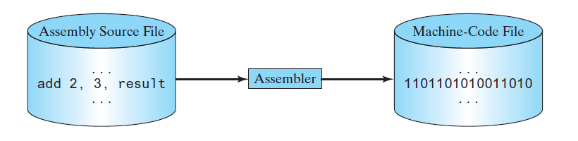
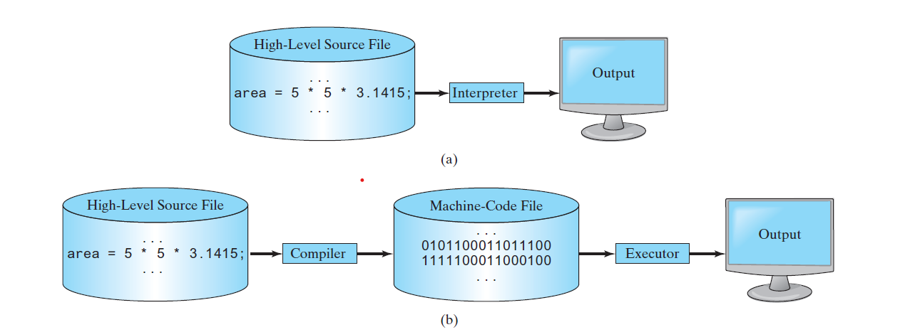
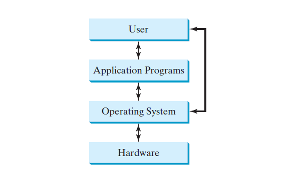

# **Programming Languages**
***Computer programs, known as software, are instructions that tell a computer what to do.
Computers do not understand human languages, so programs must be written in a language a
computer can use. There are hundreds of programming languages, and they were developed
to make the programming process easier for people. However, all programs must be converted
into the instructions the computer can execute.***

## **Machine Language**
***A computer’s native language, which differs among different types of computers, is its machine
language—a set of built-in primitive instructions. These instructions are in the form of binary
code, so if you want to give a computer an instruction in its native language, you have to enter
the instruction as binary code. For example, to add two numbers, you might have to write an
instruction in binary code as follows:***
```java
1101101010011010

```
## **Assembly Language**
***Programming in machine language is a tedious process. Moreover, programs written in
machine language are very difficult to read and modify. For this reason, assembly language
was created in the early days of computing as an alternative to machine languages. Assembly
language uses a short descriptive word, known as a mnemonic, to represent each of the
machine-language instructions. For example, the mnemonic add typically means to add numbers,
and sub means to subtract numbers. To add the numbers 2 and 3 and get the result, you
might write an instruction in assembly code as follows:***
```assembly
add 2, 3, result
```
***Assembly languages were developed to make programming easier. However, because the
computer cannot execute assembly language, another program—called an assembler—is used
to translate assembly-language programs into machine code,***


***Writing code in assembly language is easier than in machine language. However, it is still
tedious to write code in assembly language. An instruction in assembly language essentially
corresponds to an instruction in machine code. Writing in assembly language requires that you know how the CPU works. Assembly language is referred to as a low-level language, because
assembly language is close in nature to machine language and is machine dependent.***

## **High-Level Language**
***In the 1950s, a new generation of programming languages known as high-level languages
emerged. They are platform independent, which means that you can write a program in a highlevel
language and run it in different types of machines. High-level languages are similar to
English and easy to learn and use. The instructions in a high-level programming language are
called statements. Here, for example, is a high-level language statement that computes the area of
a circle with a radius of 5:***
```java
area = 5 * 5 * 3.14159;
```
| Language | Description |
| -------- | ----------- |
|||
| Ada | Named for Ada Lovelace, who worked on mechanical general-purpose computers. Developed for the Department of Defense and used mainly in defense projects. BASIC Beginner’s All-purpose Symbolic Instruction Code. Designed to be learned and used easily by beginners. |
||
| C | Developed at Bell Laboratories. Combines the power of an assembly language with the ease of use and portability
of a high-level language. |
|C++| An object-oriented language, based on C
|C# |Pronounced “C Sharp.” An object-oriented programming language developed by Microsoft.
|COBOL| COmmon Business Oriented Language. Used for business applications.
|FORTRAN| FORmula TRANslation. Popular for scientific and mathematical applications.
|Java| Developed by Sun Microsystems, now part of Oracle. An object-oriented programming language, widely used for
developing platform-independent Internet applications.|
|JavaScript| A Web programming language developed by Netscape|
|
|Pascal| Named for Blaise Pascal, who pioneered calculating machines in the seventeenth century. A simple, structured,
general-purpose language primarily for teaching programming.|
|Python| A simple general-purpose scripting language good for writing short programs.
|Visual Basic|| Visual Basic was developed by Microsoft. Enables the programmers to rapidly develop Windows-based
applications.

***A program written in a high-level language is called a source program or source code.
Because a computer cannot execute a source program, a source program must be translated
into machine code for execution. The translation can be done using another programming tool
called an interpreter or a compiler.***
1.  ***An interpreter reads one statement from the source code, translates it to the machine
code or virtual machine code, then executes it right away, as shown in Figure 1.4a.
Note a statement from the source code may be translated into several machine
instructions.***

## **Operating Systems**
    ***The operating system (OS) is the most important program that runs on a computer.
    The OS manages and controls a computer’s activities***
    *The popular operating systems for general-purpose computers are Microsoft Windows, Mac
    OS, and Linux. Application programs, such as a web browser or a word processor, cannot run
    unless an operating system is installed and running on the computer. Figure 1.5 shows the
    interrelationship of hardware, operating system, application software, and the user.*




    The major tasks of an operating system are as follows:
        1.  Controlling and monitoring system activities
        2.  Allocating and assigning system resources
        3.  Scheduling operations
## **Controlling and Monitoring System Activities**
    ***Operating systems perform basic tasks, such as recognizing input from the keyboard, sending
    output to the monitor, keeping track of files and folders on storage devices, and controlling
    peripheral devices such as disk drives and printers. An operating system must also ensure
    different programs and users working at the same time do not interfere with each other. In
    addition, the OS is responsible for security, ensuring unauthorized users and programs are not
    allowed to access the system.***
## **Allocating and Assigning System Resources**
    ***The operating system is responsible for determining what computer resources a program needs
    (such as CPU time, memory space, disks, and input and output devices) and for allocating and
    assigning them to run the program.***
## **Scheduling Operations**
    ***The OS is responsible for scheduling programs’ activities to make efficient use of system
resources. Many of today’s operating systems support techniques such as multiprogramming,
multithreading, and multiprocessing to increase system performance.
Multiprogramming allows multiple programs such as Microsoft Word, E-mail, and web
browser to run simultaneously by sharing the same CPU. The CPU is much faster than the
computer’s other components. As a result, it is idle most of the time—for example, while waiting
for data to be transferred from a disk or waiting for other system resources to respond. A
multiprogramming OS takes advantage of this situation by allowing multiple programs to use
the CPU when it would otherwise be idle. For example, multiprogramming enables you to use
a word processor to edit a file at the same time as your web browser is downloading a file.
Multithreading allows a single program to execute multiple tasks at the same time. For
instance, a word-processing program allows users to simultaneously edit text and save it to a
disk. In this example, editing and saving are two tasks within the same program. These two
tasks may run concurrently.
Multiprocessing is similar to multithreading. The difference is that multithreading is for
running multithreads concurrently within one program, but multiprocessing is for running
multiple programs concurrently using multiple processors.***
## **Java, the World Wide Web, and Beyond**
***Java is a powerful and versatile programming language for developing software running
on mobile devices, desktop computers, and servers.
This book introduces Java programming. Java was developed by a team led by James Gosling
at Sun Microsystems. Sun Microsystems was purchased by Oracle in 2010. Originally called
Oak, Java was designed in 1991 for use in embedded chips in consumer electronic appliances.
In 1995, renamed Java, it was redesigned for developing web applications. For the history of
Java, see www.java.com/en/javahistory/index.jsp.
Java has become enormously popular. Its rapid rise and wide acceptance can be traced
to its design characteristics, particularly its promise that you can write a program once
and run it anywhere. As stated by its designer, Java is simple, object oriented, distributed,
interpreted, robust, secure, architecture neutral, portable, high performance, multithreaded,
and dynamic. For the anatomy of Java characteristics, see liveexample.pearsoncmg.com/etc/
JavaCharacteristics.pdf.
Java is a full-featured, general-purpose programming language that can be used to develop
robust mission-critical applications. Today, it is employed not only for web programming but
also for developing stand-alone applications across platforms on servers, desktop computers,
and mobile devices. It was used to develop the code to communicate with and control the
robotic rover on Mars. Many companies that once considered Java to be more hype than substance
are now using it to create distributed applications accessed by customers and partners
across the Internet. For every new project being developed today, companies are asking how
they can use Java to make their work easier.
The World Wide Web is an electronic information repository that can be accessed on the
Internet from anywhere in the world. The Internet, the Web’s infrastructure, has been around
for more than 40 years. The colorful World Wide Web and sophisticated web browsers are the
major reason for the Internet’s popularity.
Java initially became attractive because Java programs can run from a web browser. Such
programs are called applets. Today applets are no longer allowed to run from a Web browser
in the latest version of Java due to security issues. Java, however, is now very popular for
developing applications on web servers. These applications process data, perform computations,
and generate dynamic webpages. Many commercial Websites are developed using Java
on the backend.
Java is a versatile programming language: You can use it to develop applications for desktop
computers, servers, and small handheld devices. The software for Android cell phones is
developed using Java.***
## **The Java Language Specification, API, JDK,JRE, and IDE**
***Java syntax is defined in the Java language specification, and the Java library is
defined in the Java application program interface (API). The JDK is the software for
compiling and running Java programs. An IDE is an integrated development environment
for rapidly developing programs.***
***Computer languages have strict rules of usage. If you do not follow the rules when writing a
program, the computer will not be able to understand it. The Java language specification and
the Java API define the Java standards.
The Java language specification is a technical definition of the Java programming
language’s syntax and semantics. You can find the complete Java language specification at
docs.oracle.com/javase/specs/.
The application program interface (API), also known as library, contains predefined classes
and interfaces for developing Java programs. The API is still expanding. You can view and
download the latest version of the Java API at download.java.net/jdk8/docs/api/. Java is a full-fledged and powerful language that can be used in many ways. It comes in
three editions:***

1. Java Standard Edition (Java SE) to develop client-side applications. The applications
can run on desktop.
1. Java Enterprise Edition (Java EE) to develop server-side applications, such as Java
servlets, JavaServer Pages (JSP), and JavaServer Faces (JSF).
1. Java Micro Edition (Java ME) to develop applications for mobile devices, such as
cell phones.
