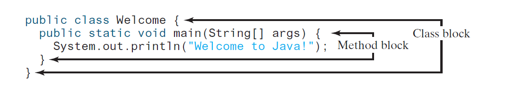
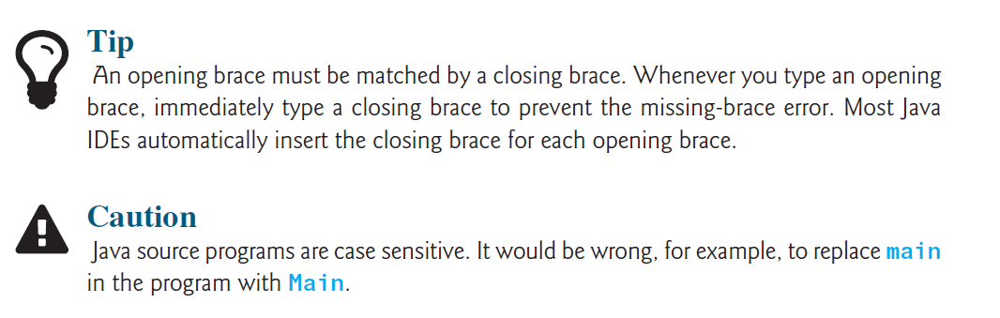
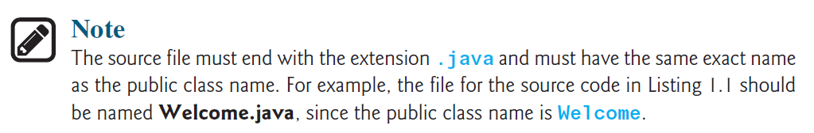
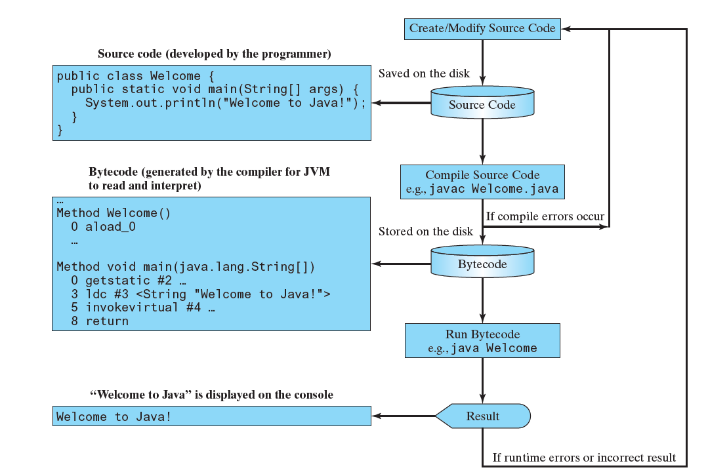
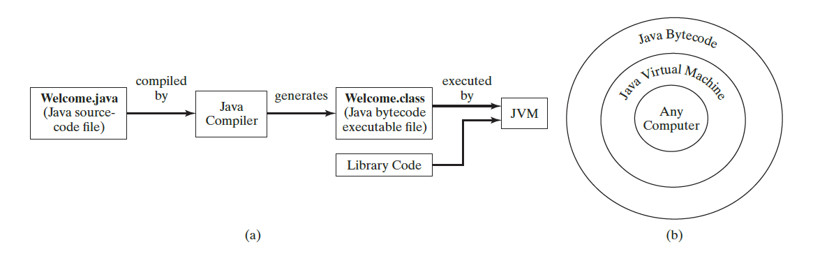
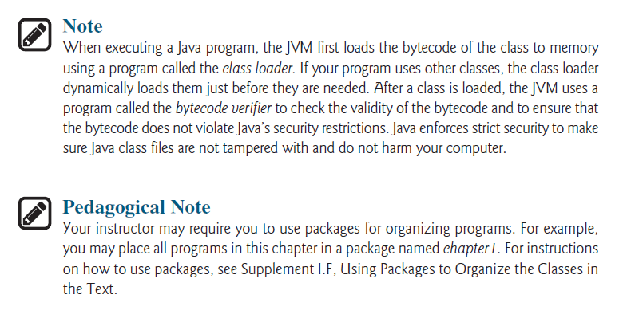

# **Simple Java Program**

```java
public class welcome {
    public static void main(String[] args){
        System.out.println("Well come to java");
    }
}
```

1.  ***Java program must have at least one `class`. Each class has a
name. By convention, class names start with an `uppercase letter`.***

1.  ***A class
may contain several `methods`. The `main method` is the entry point where the program begins execution.***

1.  ***A `method` is a construct that contains statements***

1.  ***Every statement in Java ends with a semicolon
(`;`), known as the `statement terminator`.***

1.  ***`String` is a programming term meaning a sequence of characters. string must be enclosed in `double quotation` marks***
2.  ***Reserved words, or keywords, have a specific meaning to the compiler and cannot be used for other purposes in the program***
3.  ***`comment` that documents what the program is and how it is constructed.***

    ```java
    // This application program displays Welcome to Java!
    /* This application program displays Welcome to Java! */
    /* This application program
    displays Welcome to Java! */
    ```
4.  ***A pair of `braces` in a program forms a `block` that groups the program’s components. In Java,
each block begins with an opening brace (`{`) and ends with a closing brace (`}`)`.***



    | Character | Name                                | Description                                       |
    | --------- | ----------------------------------- | ------------------------------------------------- |
    | {}        | Opening and closing braces          | Denote a block to enclose statements.             |
    | ()        | Opening and closing parentheses     | Used with methods.                                |
    | []        | Opening and closing brackets        | Denote an array.                                  |
    | //        | Double slashes                      | Precede a comment line.                           |
    | ""        | Opening and closing quotation marks | Enclose a string (i.e., sequence of  characters). |
    | ;         | Semicolon                           | Mark the end of a statement.                      |


# **WelcomeWithThreeMessages.java**

```java
public class welcomeToJavaWithThreeMessages {
    public static void main(String[] args) {
        System.out.println("Programming is fun");
        System.out.println("fundamentals first");
        System.out.println("Problem driven");

    }
}
```

```java
Programming is fun
fundamentals first
Problem driven
```
# **ComputeExpression.java**
```java 
public class computeExpression {

    public static void main(String[] args) {
        System.out.print("(10.5 + 2 * 3) / (45 – 3.5) = ");
        System.out.println((10.5 + 2 * 3) / (45 - 3.5));
    }
}
```
```java 
(10.5 + 2 * 3) / (45 – 3.5) = 0.39759036144578314
```
___
___
## **Check Point**
1.  What is a keyword? List some Java keywords.
1.  Is Java case sensitive? What is the case for Java keywords?
1.  What is a comment? Is the comment ignored by the compiler? How do you denote a comment line and a comment paragraph?
1.  What is the statement to display a string on the console?
1.  Show the output of the following code:

```java
public class Test {
    public static void main(String[] args) {
        System.out.println("3.5 * 4 / 2 – 2.5 is ");
        System.out.println(3.5 * 4 / 2 – 2.5);
    }
}
```
___
___
## **Creating, Compiling, and Executing a Java Program**

***You save a Java program in a `.java` file and `compile` it into a `.class` file. The .class file
is executed by the `Java Virtual Machine (JVM)`.***




___
___

# **check Point**
1.  What is the Java source filename extension, and what is the Java bytecode filename
extension?
1.  What are the input and output of a Java compiler?
1.  What is the command to compile a Java program?
1.  What is the command to run a Java program?
1.  What is the JVM?
1.  Can Java run on any machine? What is needed to run Java on a computer?
1.  If a NoClassDefFoundError occurs when you run a program, what is the cause
of the error?
1.  If a NoSuchMethodError occurs when you run a program, what is the cause of the
error?

___
___
2.  ******
3.  ******
4.  ******
5.  ******
6.  ******
7.  ******
8.  ******