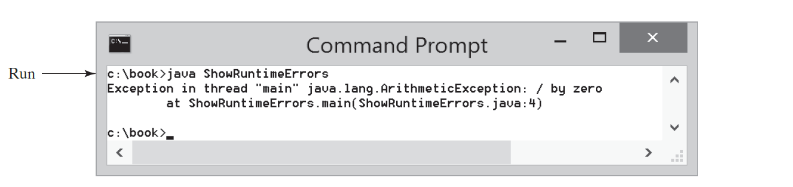
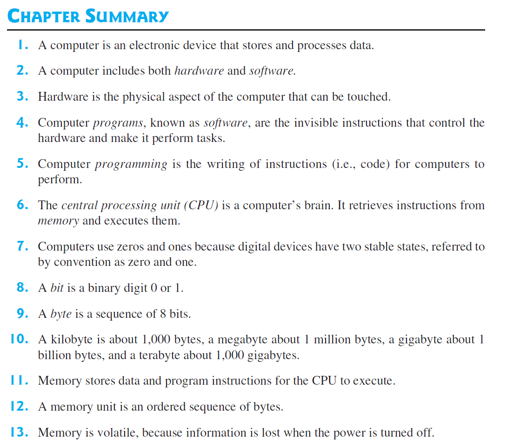
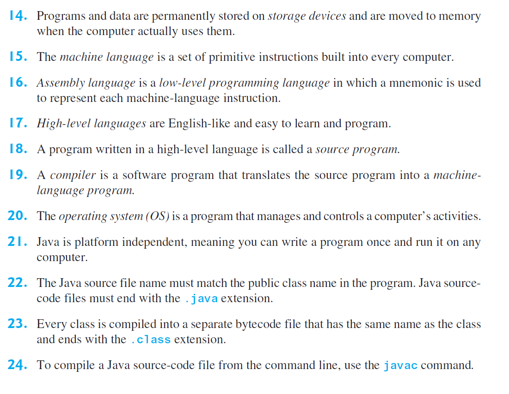
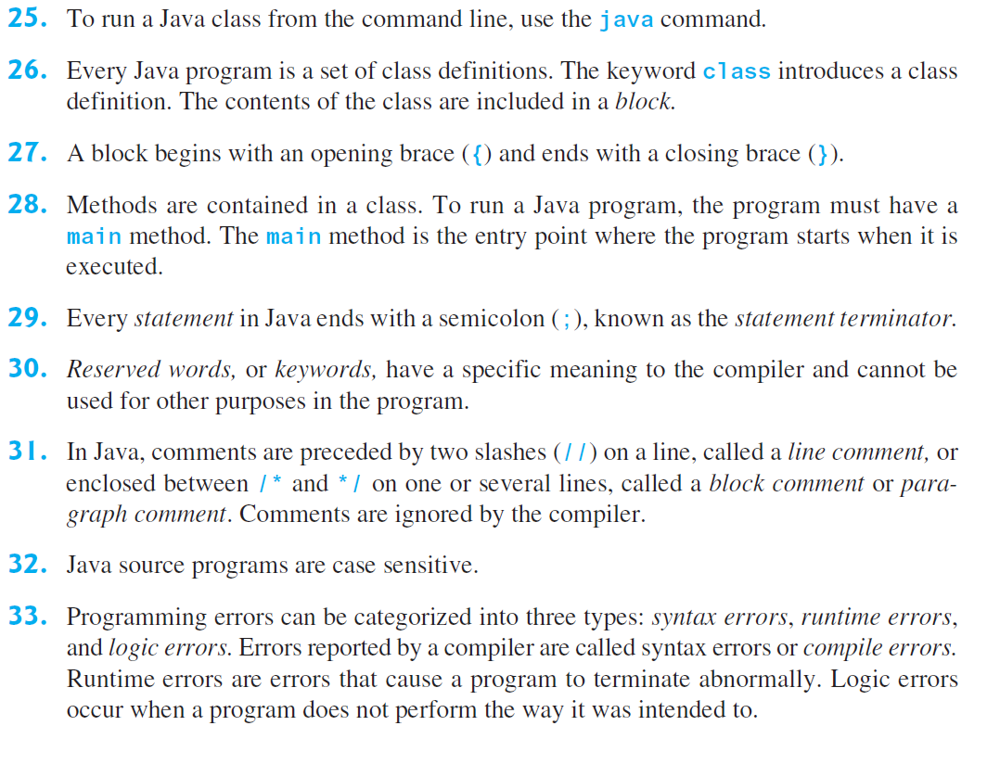
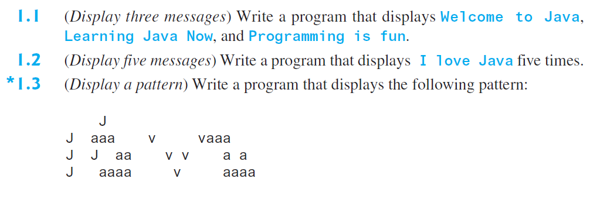
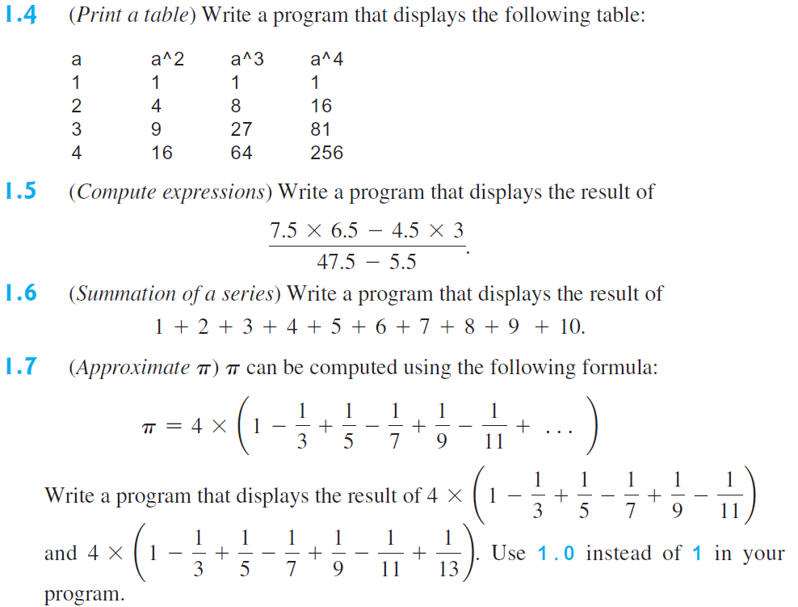
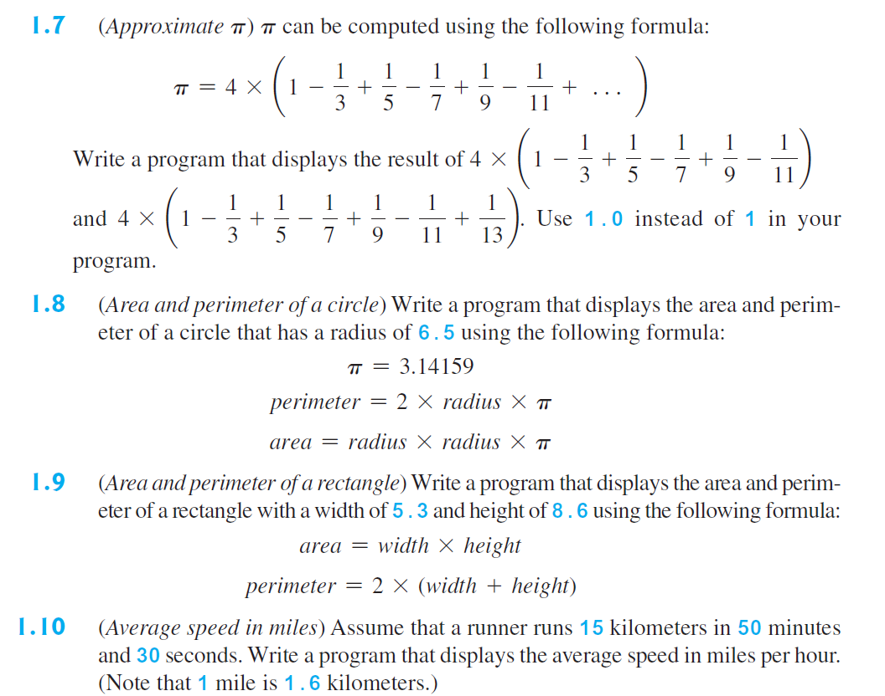
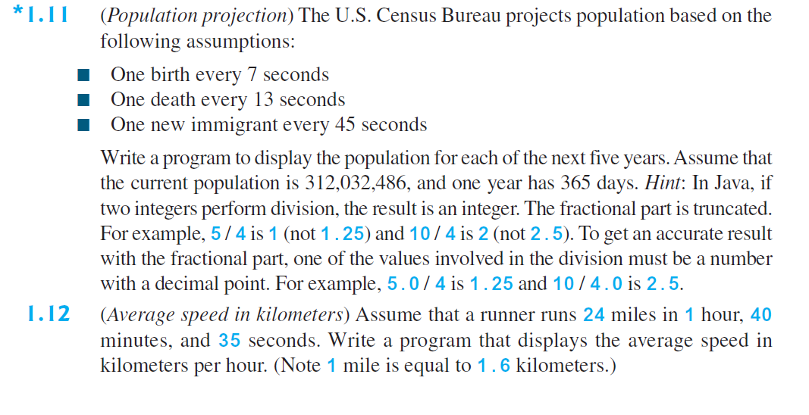

# **Simple Java Program**

```java
public class welcome {
    public static void main(String[] args){
        System.out.println("Well come to java");
    }
}
```

1.  ***Java program must have at least one `class`. Each class has a
name. By convention, class names start with an `uppercase letter`.***

1.  ***A class
may contain several `methods`. The `main method` is the entry point where the program begins execution.***

1.  ***A `method` is a construct that contains statements***

1.  ***Every statement in Java ends with a semicolon
(`;`), known as the `statement terminator`.***

1.  ***`String` is a programming term meaning a sequence of characters. string must be enclosed in `double quotation` marks***
2.  ***Reserved words, or keywords, have a specific meaning to the compiler and cannot be used for other purposes in the program***
3.  ***`comment` that documents what the program is and how it is constructed.***

    ```java
    // This application program displays Welcome to Java!
    /* This application program displays Welcome to Java! */
    /* This application program
    displays Welcome to Java! */
    ```
4.  ***A pair of `braces` in a program forms a `block` that groups the program’s components. In Java,
each block begins with an opening brace (`{`) and ends with a closing brace (`}`)`.***


    | Character | Name                                | Description                                       |
    | --------- | ----------------------------------- | ------------------------------------------------- |
    | {}        | Opening and closing braces          | Denote a block to enclose statements.             |
    | ()        | Opening and closing parentheses     | Used with methods.                                |
    | []        | Opening and closing brackets        | Denote an array.                                  |
    | //        | Double slashes                      | Precede a comment line.                           |
    | ""        | Opening and closing quotation marks | Enclose a string (i.e., sequence of  characters). |
    | ;         | Semicolon                           | Mark the end of a statement.                      |


# **WelcomeWithThreeMessages.java**

```java
public class welcomeToJavaWithThreeMessages {
    public static void main(String[] args) {
        System.out.println("Programming is fun");
        System.out.println("fundamentals first");
        System.out.println("Problem driven");

    }
}
```

```java
Programming is fun
fundamentals first
Problem driven
```
# **ComputeExpression.java**
```java 
public class computeExpression {

    public static void main(String[] args) {
        System.out.print("(10.5 + 2 * 3) / (45 – 3.5) = ");
        System.out.println((10.5 + 2 * 3) / (45 - 3.5));
    }
}
```
```java 
(10.5 + 2 * 3) / (45 – 3.5) = 0.39759036144578314
```
___
___
## **Check Point**
1.  What is a keyword? List some Java keywords.
1.  Is Java case sensitive? What is the case for Java keywords?
1.  What is a comment? Is the comment ignored by the compiler? How do you denote a comment line and a comment paragraph?
1.  What is the statement to display a string on the console?
1.  Show the output of the following code:

```java
public class Test {
    public static void main(String[] args) {
        System.out.println("3.5 * 4 / 2 – 2.5 is ");
        System.out.println(3.5 * 4 / 2 – 2.5);
    }
}
```
___
___
## **Creating, Compiling, and Executing a Java Program**

***You save a Java program in a `.java` file and `compile` it into a `.class` file. The .class file
is executed by the `Java Virtual Machine (JVM)`.***


___
___

# **check Point**
1.  What is the Java source filename extension, and what is the Java bytecode filename
extension?
1.  What are the input and output of a Java compiler?
1.  What is the command to compile a Java program?
1.  What is the command to run a Java program?
1.  What is the JVM?
1.  Can Java run on any machine? What is needed to run Java on a computer?
1.  If a NoClassDefFoundError occurs when you run a program, what is the cause
of the error?
1.  If a NoSuchMethodError occurs when you run a program, what is the cause of the
error?

___
___
# **Programming Errors**
***Programming errors can be categorized into three types: syntax errors, runtime
errors, and logic errors.***
  1. **Syntax Errors**
     1.   ***Errors that are detected by the compiler are called syntax errors or compile errors. Syntax
    errors result from errors in code construction, such as mistyping a keyword, omitting some
    necessary punctuation, or using an opening brace without a corresponding closing brace.
    These errors are usually easy to detect because the compiler tells you where they are and
    what caused them.***

## **ShowSyntaxErrors.java**
```java
public class ShowSyntaxErrors {

    public static  main(String[] args) {
        System.out.println("Welcome to Java);
    }
}
```
```java

Return type for the method is missing
String literal is not properly closed by a double-quote

```

***Since a single error will often display many lines of compile errors, it is a good practice to
fix errors from the top line and work downward. Fixing errors that occur earlier in the program
may also fix additional errors that occur later***

  2. Programming Errors
  3. Syntax Errors
  4. Syntax Errors
  5. Syntax Errors

## **Runtime Errors**   
 ***Programming errors can be categorized into three types: syntax errors, runtime
errors, and logic errors.***
***Runtime errors are errors that cause a program to terminate abnormally. They occur while a
program is running if the environment detects an operation that is impossible to carry out. Input
mistakes typically cause runtime errors. An input error occurs when the program is waiting
for the user to enter a value, but the user enters a value that the program cannot handle. For
instance, if the program expects to read in a number, but instead the user enters a string, this
causes data-type errors to occur in the program.
Another example of runtime errors is division by zero. This happens when the divisor is
zero for integer divisions.***
## **ShowRuntimeErrors.java**
```java
public class ShowRuntimeErrors {

    public static void main(String[] args) {
        System.out.println(1 / 0);
    }
}
```

## **Logic Errors**
***Logic errors occur when a program does not perform the way it was intended to. Errors of this
kind occur for many different reasons. For example, suppose you wrote the program in
Listing 1.6 to convert Celsius 35 degrees to a Fahrenheit degree:***

```java
public class ShowLogicErrors {

    public static void main(String[] args) {
        System.out.println("Celsius 35 is Fahrenheit degree");
        System.out.println((9 / 5) * 35 + 32);

    }
}
```
```java
Celsius 35 is Fahrenheit degree
67
```
## **Summery**




# **Programming ExerCises**




