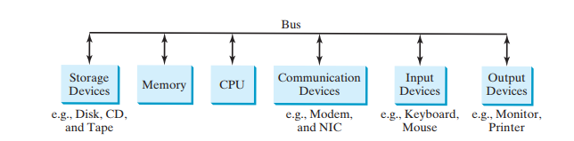
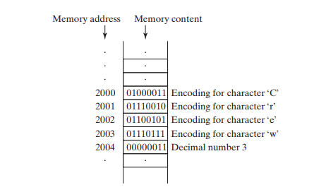

# What is a Computer
## ***A computer is an electronic device that stores and processes data***

**A computer consists of the following major hardware components**

1.  **A central processing unit (CPU)**
2.  **Memory (main memory)**
3.   **Storage devices (such as disks and CDs)** 
4.   **Input devices (such as the mouse and the keyboard)**
5.   **Output devices (such as monitors and printers)** 
6.   **Communication devices (such as modems and network interface cards (NIC))**

***A computer’s components are interconnected by a subsystem called a bus. You can think
of a bus as a sort of system of roads running among the computer’s components; data and
power travel along the bus from one part of the computer to another. In personal computers,***

1. ## **Centaral Processing unit**
   
    ***The central processing unit (CPU) is the computer’s brain. It retrieves instructions from the
    memory and executes them. The CPU usually has two components: a control unit and an
    arithmetic/logic unit. The control unit controls and coordinates the actions of the other components. The arithmetic/logic unit performs numeric operations (addition, subtraction, multiplication, and division) and logical operations (comparisons).
    Today’s CPUs are built on small silicon semiconductor chips that contain millions of tiny
    electric switches, called transistors, for processing information.
    Every computer has an internal clock that emits electronic pulses at a constant rate. These
    pulses are used to control and synchronize the pace of operations. A higher clock speed enables
    more instructions to be executed in a given period of time. The unit of measurement of clock
    speed is the hertz (Hz), with 1 Hz equaling 1 pulse per second. In the 1990s, computers measured clock speed in megahertz (MHz), but CPU speed has been improving continuously; the
    clock speed of a computer is now usually stated in gigahertz (GHz). Intel’s newest processors
    run at about 3 GHz.
    CPUs were originally developed with only one core. The core is the part of the processor
    that performs the reading and executing of instructions. In order to increase the CPU processing
    power, chip manufacturers are now producing CPUs that contain multiple cores. A multicore
    CPU is a single component with two or more independent cores. Today’s consumer computers typically have two, three, and even four separate cores. Soon, CPUs with dozens or even
    hundreds of cores will be affordable.***

 1. ## **Bits and Bytes**
     ***Before we discuss memory, let’s look at how information (data and programs) are stored in
    a computer.
    A computer is really nothing more than a series of switches. Each switch exists in two states:
    on or off. Storing information in a computer is simply a matter of setting a sequence of switches
    on or off. If the switch is on, its value is 1. If the switch is off, its value is 0. These 0s and 1s
    are interpreted as digits in the binary number system and are called bits (binary digits).
    The minimum storage unit in a computer is a byte. A byte is composed of eight bits. A small
    number such as 3 can be stored as a single byte. To store a number that cannot fit into a single
    byte, the computer uses several bytes.
    Data of various kinds, such as numbers and characters, are encoded as a series of bytes. As
    a programmer, you don’t need to worry about the encoding and decoding of data, which the
    computer system performs automatically, based on the encoding scheme. An encoding scheme
    is a set of rules that govern how a computer translates characters and numbers into data with
    which the computer can actually work. Most schemes translate each character into a***

    ***predetermined string of bits. In the popular ASCII encoding scheme, for example, the character
    C is represented as 01000011 in 1 byte.
    A computer’s storage capacity is measured in bytes and multiples of the byte, as follows:***

      1. **A kilobyte (KB) is about 1,000 bytes.**
      2. **A megabyte (MB) is about 1 million bytes.**
      3. **A gigabyte (GB) is about 1 billion bytes.**
      4. **A terabyte (TB) is about 1 trillion bytes.**

    ***A typical one-page word document might take 20 KB. Therefore, 1 MB can store 50 pages
    of documents, and 1 GB can store 50,000 pages of documents. A typical two-hour highresolution movie might take 8 GB, so it would require 160 GB to store 20 movies.***

 1. ## **Memory**
   
   ***A computer’s memory consists of an ordered sequence of bytes for storing programs as well
    as data with which the program is working. You can think of memory as the computer’s work
    area for executing a program. A program and its data must be moved into the computer’s
    memory before they can be executed by the CPU.
    Every byte in the memory has a unique address, as shown in Figure 1.2. The address is used
    to locate the byte for storing and retrieving the data. Since the bytes in the memory can be
    accessed in any order, the memory is also referred to as random-access memory (RAM).***

***Today’s personal computers usually have at least 4 GB of RAM, but they more commonly
    have 6 to 8 GB installed. Generally speaking, the more RAM a computer has, the faster it can
    operate, but there are limits to this simple rule of thumb.
    A memory byte is never empty, but its initial content may be meaningless to your program.
    The current content of a memory byte is lost whenever new information is placed in it.
    Like the CPU, memory is built on silicon semiconductor chips that have millions of transistors embedded on their surface. Compared to CPU chips, memory chips are less complicated,
    slower, and less expensive***

4. ## **Storage Devices**
    1. ***A computer’s memory (RAM) is a volatile form of data storage: Any information that has been saved in memory is lost when the system’s power is turned off. Programs and data are permanently stored on storage devices and are moved, when the computer actu ally uses them, to memory, which operates at much faster speeds than permanent storage devices can.***
    
    **There are three main types of storage devices:**

        1.  Magnetic disk drives
        1. Optical disc drives (CD and DVD)
        1. Universal serial bus (USB) flash drives
    `Drives`

    are devices for operating a medium, such as disks and CDs. A storage medium
    physically stores data and program instructions. The drive reads data from the medium and
    writes data onto the medium.

    `Disks`

    A computer usually has at least one hard disk drive. Hard disks are used for permanently storing data and programs. Newer computers have hard disks that can store from 500 GB to 1 TB
    of data. Hard disk drives are usually encased inside the computer, but removable hard disks
    are also available.

    `CDs and DVDs`

    CD stands for compact disc. There are three types of CDs: CD-ROM, CD-R, and CD-RW. A CDROM is a prepressed disc. It was popular for distributing software, music, and video. Software,
    music, and video are now increasingly distributed on the Internet without using CDs. A CD-R
    (CD-Recordable) is a write-once medium. It can be used to record data once and read any number
    of times. A CD-RW (CD-ReWritable) can be used like a hard disk; that is, you can write data onto
    the disc, then overwrite that data with new data. A single CD can hold up to 700 MB.
    DVD stands for digital versatile disc or digital video disc. DVDs and CDs look alike, and
    you can use either to store data. A DVD can hold more information than a CD; a standard
    DVD’s storage capacity is 4.7 GB. There are two types of DVDs: DVD-R (Recordable) and
    DVD-RW (ReWritable).

    `USB Flash Drives`

    Universal serial bus (USB) connectors allow the user to attach many kinds of peripheral
    devices to the computer. You can use an USB to connect a printer, digital camera, mouse,
    external hard disk drive, and other devices to the computer.
    An USB flash drive is a device for storing and transporting data. A flash drive is small—about
    the size of a pack of gum. It acts like a portable hard drive that can be plugged into your computer’s
    USB port. USB flash drives are currently available with up to 256 GB storage capacity.

 5. ## **Input and Output Devices**
    Input and output devices let the user communicate with the computer. The most common
    input devices are the keyboard and mouse. The most common output devices are `monitors`
    and `printers`.

    
    **The `Keyboard`**

    ***A keyboard is a device for entering input. Compact keyboards are available without a numeric keypad. Function keys are located across the top of the keyboard and are prefaced with the letter F.
    Their functions depend on the software currently being used.
    A modifier key is a special key (such as the Shift, Alt, and Ctrl keys) that modifies the normal
    action of another key when the two are pressed simultaneously.
    The numeric keypad, located on the right side of most keyboards, is a separate set of keys
    styled like a calculator to use for quickly entering numbers.
    Arrow keys, located between the main keypad and the numeric keypad, are used to move
    the mouse pointer up, down, left, and right on the screen in many kinds of programs.
    The Insert, Delete, Page Up, and Page Down keys are used in word processing and other
    programs for inserting text and objects, deleting text and objects, and moving up or down
    through a document one screen at a time.***
    
    
    
    **The `Mouse`**
    
    ***A mouse is a pointing device. It is used to move a graphical pointer (usually in the shape of
    an arrow) called a cursor around the screen, or to click on-screen objects (such as a button) to
    trigger them to perform an action.
    The Monitor
    The monitor displays information (text and graphics). The screen resolution and dot pitch
    determine the quality of the display.
    The screen resolution specifies the number of pixels in horizontal and vertical dimensions
    of the display device. Pixels (short for “picture elements”) are tiny dots that form an image on
    the screen. A common resolution for a 17-inch screen, for example, is 1,024 pixels wide and
    768 pixels high. The resolution can be set manually. The higher the resolution, the sharper and
    clearer the image is.
    The dot pitch is the amount of space between pixels, measured in millimeters. The smaller
    the dot pitch, the sharper is the display***

 6. ## **Communication Devices**

    ***Computers can be networked through communication devices, such as a dial-up modem
    (modulator/demodulator), a digital subscriber line (DSL) or cable modem, a wired network
    interface card, or a wireless adapter.***

    1.  A dial-up modem uses a phone line to dial a phone number to connect to the Internet
    and can transfer data at a speed up to 56,000 bps (bits per second).
    1.  A digital subscriber line (DSL) connection also uses a standard phone line, but it can
    transfer data 20 times faster than a standard dial-up modem.
    1.  A cable modem uses the cable line maintained by the cable company and is generally
    faster than DSL.
    1.  A network interface card (NIC) is a device that connects a computer to a local area
    network (LAN). LANs are commonly used to connect computers within a limited area
    such as a school, a home, and an office. A high-speed NIC called 1000BaseT can
    transfer data at 1,000 million bits per second (mbps).
    1.  Wireless networking is now extremely popular in homes, businesses, and schools.
    Every laptop computer sold today is equipped with a wireless adapter that enables the
    computer to connect to the LAN and the Internet.
