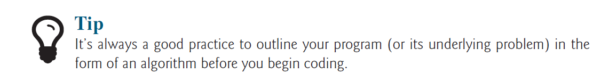
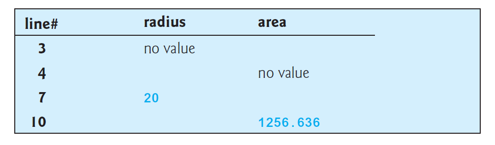
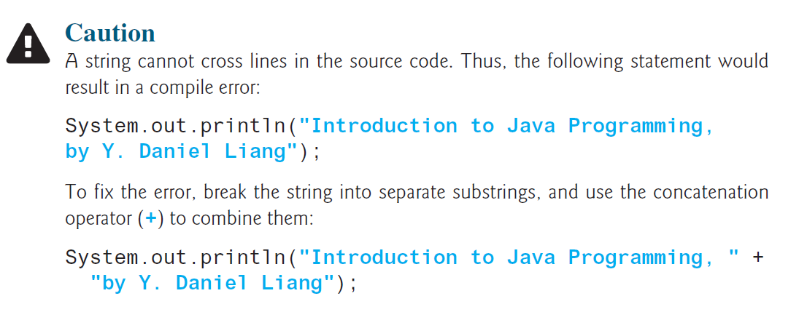
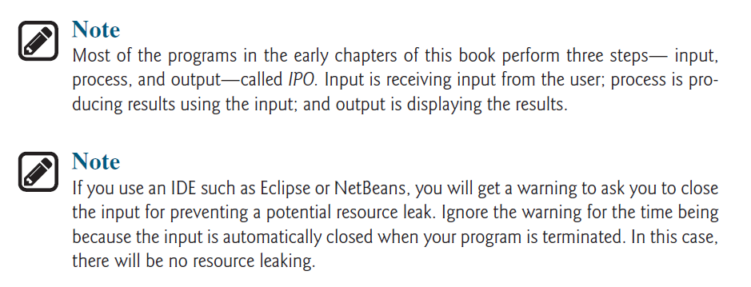
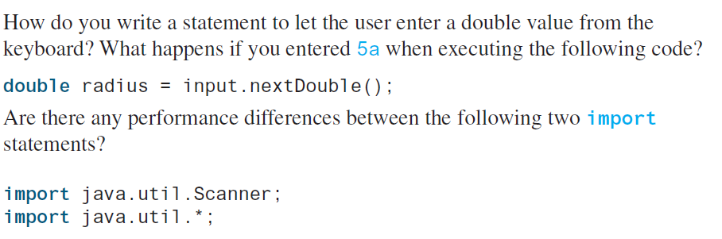
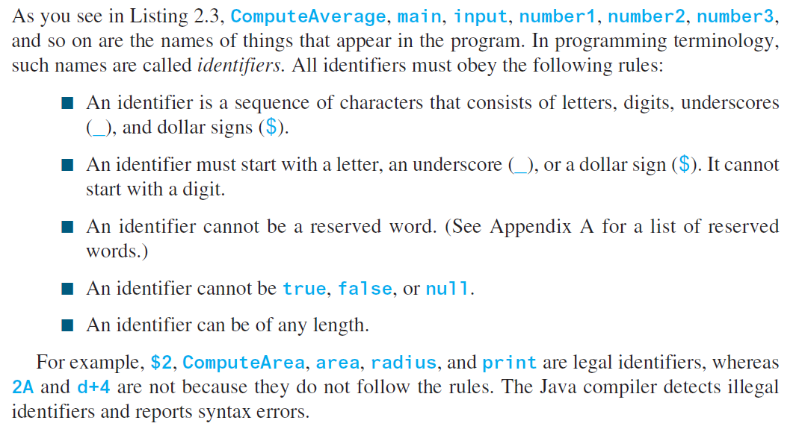
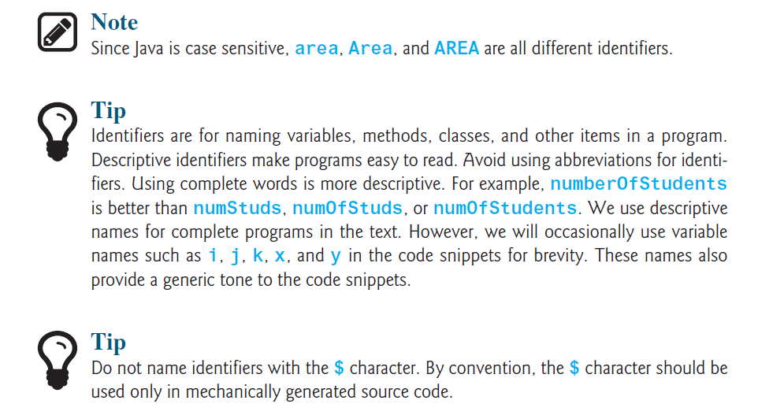
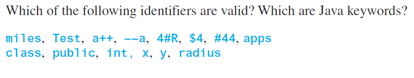

# **Introduction**
***The focus of this chapter is on learning elementary programming techniques to solve
problems.***

## ***Writing a Simple Program***

**Writing a program involves designing a strategy for solving the problem then using a programming language to implement that strategy.**

```
Let’s first consider the simple problem of computing the area of a circle. How do we write a
program for solving this problem?
```

***Writing a program involves designing `algorithms` and translating algorithms into `programming`
instructions, or code. An algorithm lists the steps you can follow to solve a problem.
Algorithms can help the programmer plan a program before writing it in a programming
language. Algorithms can be described in natural languages or in `pseudocode` (natural language
mixed with some programming code). The algorithm for calculating the area of a circle can be
described as follows:***

```
1. Read in the circle’s radius.
2. Compute the area using the following formula:
```
$$area = radius*radius*pi$$

```
3. Display the result.

```


```java

public class ComputeArea {

    public static void main(String[] args) {
        
    }
}

```

***The program needs to read the radius entered by the user from the keyboard. This raises
two important issues:
1.  Reading the radius
1.  Storing the radius in the program
Let’s address the second issue first. In order to store the radius, the program needs to declare
a symbol called a variable. A variable represents a value stored in the computer’s memory.
Rather than using x and y as variable names, choose descriptive names: in this case, radius
for radius and area for area. To let the compiler know what radius and area are, specify
their data types. That is the kind of data stored in a variable, whether an integer, real number,
or something else. This is known as declaring variables. Java provides simple data types for
representing integers, real numbers, characters, and Boolean types. These types are known as
primitive data types or fundamental types.
Real numbers (i.e., numbers with a decimal point) are represented using a method known
as floating-point in computers. Therefore, the real numbers are also called floating-point
numbers. In Java, you can use the keyword double to declare a floating-point variable. Declare
radius and area as double. The program can be expanded as follows:***


```java
public class ComputeArea {

    public static void main(String[] args) {
        double radius;
        double area;

    }
}
```

***The program declares radius and area as variables. The reserved word double indicates
that radius and area are floating-point values stored in the computer.
The first step is to prompt the user to designate the circle’s radius. You will soon learn
how to prompt the user for information. For now, to learn how variables work, you can assign
a fixed value to radius in the program as you write the code. Later, you’ll modify the program
to prompt the user for this value.
The second step is to compute area by assigning the result of the expression radius *
radius * 3.14159 to area.
In the final step, the program will display the value of area on the console by using the
System.out.println method.
Listing 2.1 shows the complete program, and a sample run of the program is shown in Figure 2.1.***

## **ComputeArea.java**

```java
public class ComputeArea {

    public static void main(String[] args) {
        double radius;
        double area;

        radius = 20;
        area = radius * radius * 3.14159;
        System.out.println("The Area Of the Circle of Radius " + radius + " is " + area);
    }
}
```
```java

The Area Of the Circle of Radius 20.0 is 1256.636

```

***Variables such as radius and area correspond to memory locations. Every variable has
a name, a type, and a value. Line 3 declares that radius can store a double value. The value
is not defined until you assign a value. Line 7 assigns 20 into the variable radius. Similarly,
line 4 declares the variable area, and line 10 assigns a value into area. The following table
shows the value in the memory for area and radius as the program is executed. Each row
in the table shows the values of variables after the statement in the corresponding line in the
program is executed. This method of reviewing how a program works is called tracing a program.
Tracing programs are helpful for understanding how programs work, and they are useful
tools for finding errors in programs.***



***The plus sign (+) has two meanings: one for addition, and the other for concatenating (combining)
strings. The plus sign (+) in lines 13–14 is called a string concatenation operator. It
combines two strings into one. If a string is combined with a number, the number is converted
into a string and concatenated with the other string. Therefore, the plus signs (+) in lines 13–14
concatenate strings into a longer string, which is then displayed in the output. Strings and string
concatenation will be discussed further in Chapter 4.***




# **Reading Input from the Console**
***Reading input from the console enables the program to accept input from the user.***

***the radius is fixed in the source code. To use a different radius, you have to
modify the source code and recompile it. Obviously, this is not convenient, so instead you can
use the `Scanner` class for console input.
Java uses `System.out` to refer to the `standard output device`, and `System.in` to the
`standard input device`. By `default`, the `output` device is the display `monitor`, and the `input`
device is the `keyboard`. To perform console output, you simply use the println method to
display a primitive value or a string to the console. To perform console input, you need to use
the Scanner class to create an object to read input from System.in, as follows:
```java
Scanner input = new Scanner(System.in);
```

The syntax new Scanner(System.in) creates an object of the Scanner type. The syntax
Scanner input declares that input is a variable whose type is Scanner. The whole line
Scanner input = new Scanner(System.in) creates a Scanner object and assigns its
reference to the variable input. An object may invoke its methods. To invoke a method on
an object is to ask the object to perform a task. You can invoke the nextDouble() method
to read a double value as follows:
```java
double radius = input.nextDouble();
```

This statement reads a number from the keyboard and assigns the number to radius.
Listing 2.2 rewrites Listing 2.1 to prompt the user to enter a radius.***

## **ComputeAreaWithConsoleInput.java**
```java
public class ComputeAreaWithConsoleInput {

    public static void main(String[] args) {
        Scanner input = new Scanner(System.in);
        System.out.println("Enter a number for Radius");

        double radius = input.nextDouble();

        double area = radius * radius * 3.14159;
        System.out.println("The area of the circle in radius " + radius + " is " + area);
    }
}
```

```java
Enter a number for Radius
12
The area of the circle in radius 12.0 is 452.38896

```
## **ComputeAverage.java**

```java
public class ComputeAverage {

    public static void main(String[] args) {
        Scanner input = new Scanner(System.in);

        System.out.println("Enter Three numbers");
        double number1 = input.nextDouble();
        double number2 = input.nextDouble();
        double number3 = input.nextDouble();

        double average = (number1 + number2 + number3) / 3;
        System.out.println("average: " + average);
    }
}
```

```java
Enter Three numbers
12
12
12
average: 12.0
```




## **Identifiers**
***Identifiers are the names that identify the elements such as classes, methods, and
variables in a program.***



